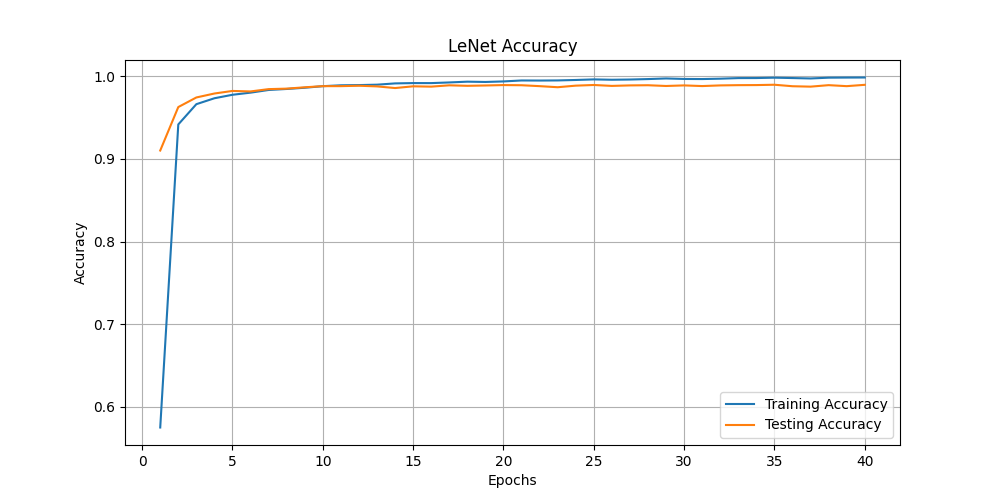
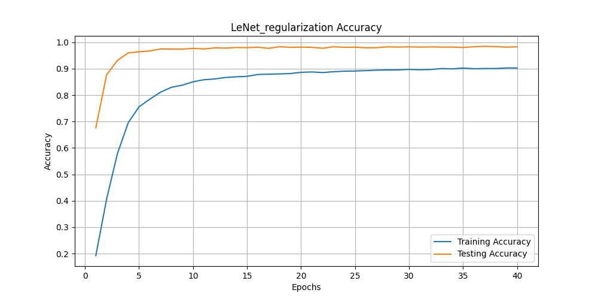
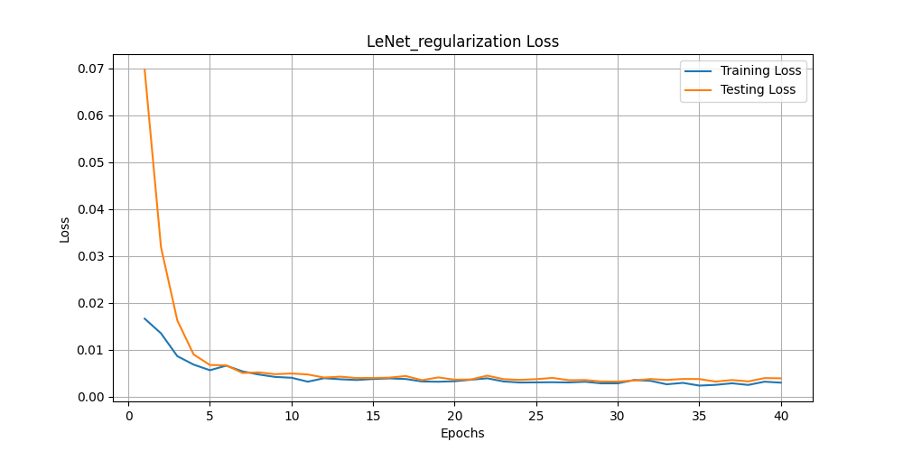

# MNIST Classification

In this assignment, you build a neural network classifier with MNIST dataset. For a detailed description about MNIST dataset, please refer to [this link](http://yann.lecun.com/exdb/mnist/).

- Due date: 2024. 04. 16. Tue 23:59
- Submission: Personal Github repo URL
    - `dataset.py`, `model.py`, `main.py` , `README.md` (Report) files
- Total score: High/Medium/Low
- Requirements
    1. You should write your own pipeline to provide data to your model. 
        Write your code in the template `dataset.py`. 
        Please read the comments carefully and follow those instructions.
    

    3. Write `main.py` to train your models, LeNet-5 and custom MLP. Here, you should monitor the training process. 
    To do so, you need some statistics such as average loss values and accuracy at the end of each epoch.
    
    Reports
    2. (Report) Implement LeNet-5 and your custom MLP models in `model.py`. 
        Some instructions are given in the file as comments. Note that your custom MLP 
        model should have about the same number of model parameters with LeNet-5. 
        Describe the number of model parameters of LeNet-5 and your custom MLP and how to compute them in your report.
        
        ![Report]
        # LeNet-5
            Conv2d layer: (input_channels * output_channels * kernel_height * kernel_width) + output_channels = (1 * 6 * 5 * 5) + 6 = 156
            Conv2d layer: (input_channels * output_channels * kernel_height * kernel_width) + output_channels = (6 * 16 * 5 * 5) + 16 = 2416
            Linear layer: (in_features * out_features) + out_features = (1644 * 120) + 120 = 48120
            Linear layer: (in_features * out_features) + out_features = (120 * 84) + 84 = 10164
            Linear layer: (in_features * out_features) + out_features = (84 * 10) + 10 = 850
            Total parameters for LeNet-5 = 156 + 2416 + 48120 + 10164 + 850 = 61606
        
        # Custom MLP
            First Linear layer: (in_features * out_features) + out_features = (784 * 77) + 77 = 60313
            Second Linear layer: (in_features * out_features) + out_features = (77 * 10) + 10 = 780
            Total parameters for CustomMLP = 60313 + 780 = 61093
    
    4. (Report) Plot above statistics, average loss value and accuracy, for training and testing. 
        It is fine to use the test dataset as a validation dataset. 
        Therefore, you will have four plots for each model: loss and accuracy curves for training and test datasets, respectively.
        
        ![Report]
        
        
        
        
        
        
        
        
    5. (Report) Compare the predictive performances of LeNet-5 and your custom MLP. 
        Also, make sure that the accuracy of LeNet-5 (your implementation) is similar to the known accuracy. 
        
        LeNet-5 Test Accruacy: Test Acc: 0.9901
        CustomMLP Test Accruacy: Test Acc: 0.9789
        
        
    6. (Report) Employ at least more than two regularization techniques to improve LeNet-5 model. 
        You can use whatever techniques if you think they may be helpful to improve the performance. 
        Verify that they actually help improve the performance. 
        Keep in mind that when you employ the data augmentation technique, 
        it should be applied only to training data. So, the modification of provided `MNIST` class in `dataset.py` may be needed.
        
        ![Report]
        The weight decay 0.01 and dropout rate 0.5 are used as regularization methods in this model. 
        The data has been augumented with the 
        Kindly compare the two models performance below
        
        
        
        
        Test Loss: 0.0006, Test Acc: 0.9733
        
        